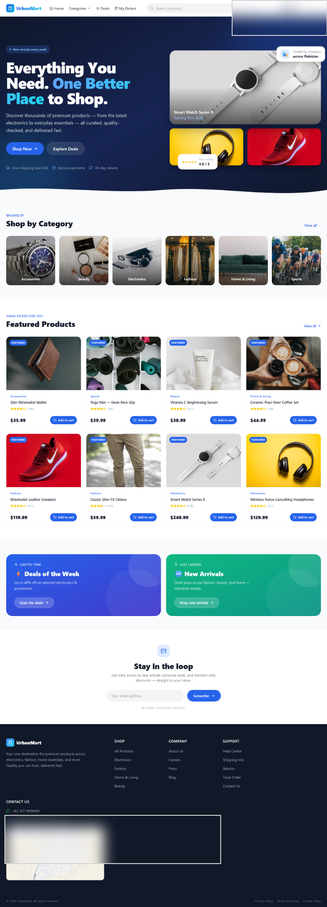
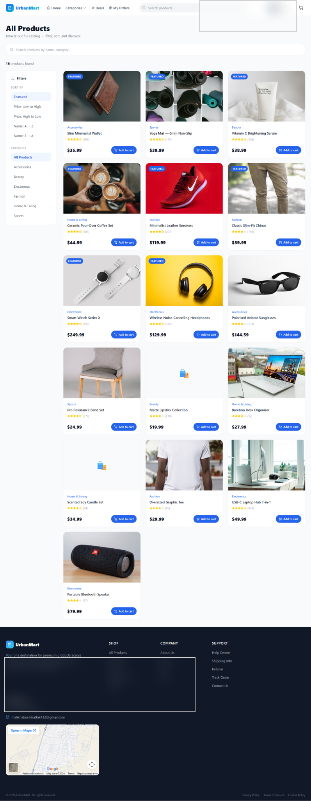
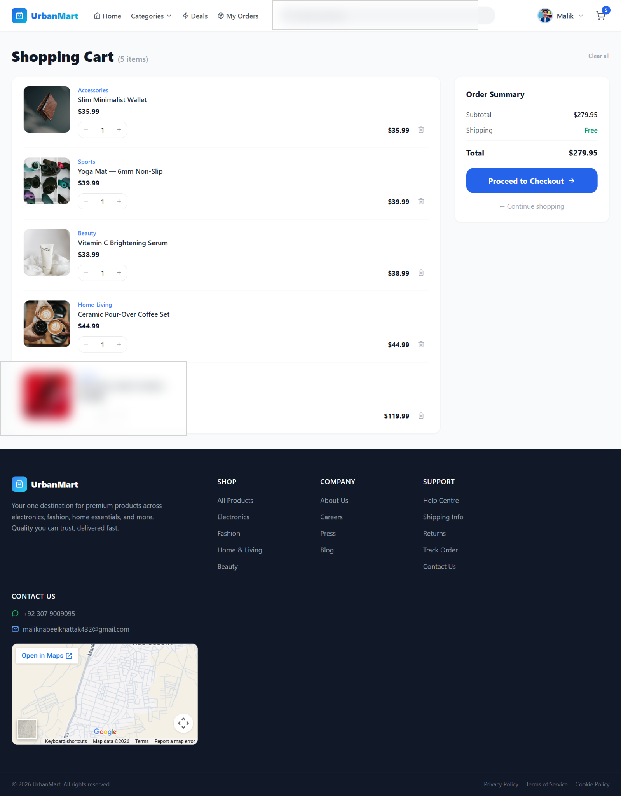
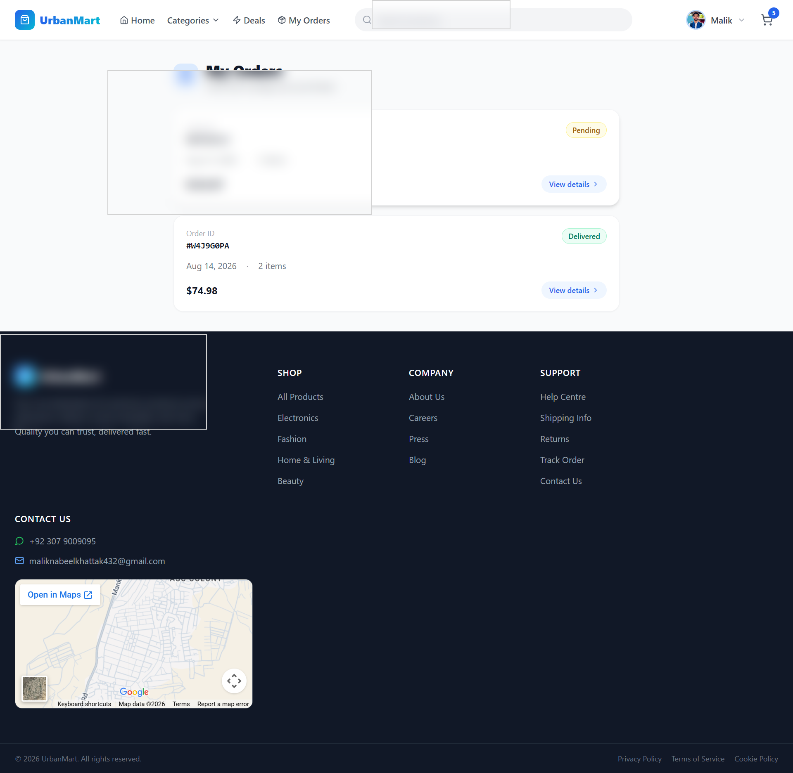
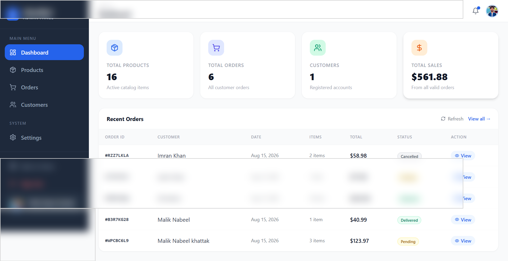

# 🛒 UrbanMart

A modern, responsive e-commerce web application built with **React, Vite, Tailwind CSS, Zustand, and Firebase**.

UrbanMart provides a complete shopping experience for customers, together with a protected admin dashboard for managing products, orders, and customers.

## 🌐 Live Demo

**[Visit UrbanMart](https://urbanmart.web.app/)**

## 📸 Screenshots

### 🏠 Homepage



### 🛍️ Products



### 🛒 Shopping Cart



### 📦 My Orders



### 👑 Admin Dashboard



---

## ✨ Features

### 🛍️ Customer Features

* User registration and login
* Google authentication
* Responsive homepage
* Product browsing
* Product categories
* Product search
* Product filtering
* Product details
* Add products to cart
* Increase/decrease product quantity
* Remove products from cart
* Clear shopping cart
* Persistent cart using local storage
* Secure checkout
* Delivery information form
* Order notes
* Order confirmation
* Unique order ID
* My Orders page
* Individual order details
* Order status tracking

### 👑 Admin Features

* Protected admin dashboard
* Admin-only access control
* Dashboard statistics
* Product management
* Add new products
* Edit products
* Delete products
* Product search
* Product filtering
* Order management
* Order details
* Update order status
* Customer management
* Responsive admin sidebar
* Admin settings page

### 🔐 Security

* Firebase Authentication
* Role-based customer/admin access
* Protected admin routes
* Firestore Security Rules
* Customer order ownership checks
* Admin-only product modifications
* Admin-only order management
* Protected user documents
* Default Firestore deny rule

---

## 🛠️ Tech Stack

### Frontend

* **React**
* **Vite**
* **JavaScript**
* **Tailwind CSS**
* **React Router**
* **Zustand**
* **Lucide React**
* **React Hot Toast**

### Backend / Cloud Services

* **Firebase Authentication**
* **Cloud Firestore**
* **Firebase Hosting**

### Development

* npm
* Git
* GitHub

---

## 🏗️ Application Architecture

```text
                    ┌─────────────────────┐
                    │      Customer       │
                    └──────────┬──────────┘
                               │
                               ▼
                    ┌─────────────────────┐
                    │   React Frontend    │
                    │ Vite + Tailwind CSS │
                    └──────────┬──────────┘
                               │
              ┌────────────────┼────────────────┐
              │                │                │
              ▼                ▼                ▼
      ┌──────────────┐ ┌──────────────┐ ┌──────────────┐
      │   Firebase   │ │  Firestore   │ │    Zustand   │
      │ Authentication│ │   Database   │ │  Cart State  │
      └──────────────┘ └──────────────┘ └──────────────┘
                               │
                               ▼
                    ┌─────────────────────┐
                    │   Firebase Hosting  │
                    └─────────────────────┘
```

---

## 📦 Main Application Flow

```text
Register / Login
       ↓
    Homepage
       ↓
    Products
       ↓
 Product Details
       ↓
   Add to Cart
       ↓
 Shopping Cart
       ↓
    Checkout
       ↓
  Create Order
       ↓
Order Confirmation
       ↓
    My Orders
       ↓
  Track Status
```

### Admin Flow

```text
Admin Login
     ↓
Admin Dashboard
     ↓
 ┌───┼───────────────┐
 ↓   ↓               ↓
Products          Orders
 ↓                   ↓
Add/Edit/Delete   View/Update
                     ↓
                Order Status
```

---

## 🗂️ Firestore Data Structure

### Users

```text
users/{userId}

├── uid
├── name
├── email
├── photoURL
├── role
└── createdAt
```

Roles:

```text
customer
admin
```

### Products

```text
products/{productId}

├── title
├── description
├── price
├── category
├── imageURL
├── stock
├── createdAt
└── updatedAt
```

### Orders

```text
orders/{orderId}

├── userId
├── customerInfo
├── items
├── subtotal
├── shipping
├── total
├── status
├── createdAt
└── updatedAt
```

---

## 🔒 Firestore Security

UrbanMart uses Firebase Firestore Security Rules to control access to application data.

### Customers

Customers can:

* Read public products
* Read their own orders
* Create their own orders
* Read their own user profile

### Administrators

Administrators can:

* Create, update, and delete products
* Read and manage orders
* Read customer information
* Access the admin dashboard

### Default Access

Unmatched Firestore requests are denied.

This provides a server-side security layer in addition to frontend route protection.

---

## 🚀 Getting Started

### 1. Clone the repository

```bash
git clone https://github.com/nabeelmalik122/urban-mart-web.git
```

### 2. Navigate to the project

```bash
cd urban-mart-web
```

### 3. Install dependencies

```bash
npm install
```

### 4. Configure Firebase

Create a `.env` file in the project root:

```env
VITE_FIREBASE_API_KEY=your_api_key
VITE_FIREBASE_AUTH_DOMAIN=your_project.firebaseapp.com
VITE_FIREBASE_PROJECT_ID=your_project_id
VITE_FIREBASE_STORAGE_BUCKET=your_project.firebasestorage.app
VITE_FIREBASE_MESSAGING_SENDER_ID=your_sender_id
VITE_FIREBASE_APP_ID=your_app_id
VITE_FIREBASE_MEASUREMENT_ID=your_measurement_id
```

> Never commit your real `.env` file to GitHub.

### 5. Start the development server

```bash
npm run dev
```

The application will normally be available at:

```text
http://localhost:5173
```

### 6. Create a production build

```bash
npm run build
```

---

## 📁 Project Structure

```text
urban-mart-web/
│
├── public/
│
├── screenshots/
│   ├── admin-dashboard.png
│   ├── cart.png
│   ├── homepage.png
│   ├── orders.png
│   └── products.png
│
├── src/
│   ├── components/
│   │   ├── admin/
│   │   ├── common/
│   │   └── ...
│   │
│   ├── firebase/
│   │   ├── admin.js
│   │   ├── orders.js
│   │   └── ...
│   │
│   ├── pages/
│   │   ├── admin/
│   │   ├── auth/
│   │   ├── cart/
│   │   ├── checkout/
│   │   ├── products/
│   │   └── ...
│   │
│   ├── store/
│   │   ├── authStore.js
│   │   └── cartStore.js
│   │
│   ├── App.jsx
│   └── main.jsx
│
├── .env.example
├── .gitignore
├── package.json
├── vite.config.js
└── README.md
```

---

## 👤 User Roles

### Customer

Customers can browse products, manage their cart, place orders, and track their own orders.

### Admin

Administrators have access to the protected `/admin` area.

Admin permissions include:

```text
/admin
/admin/products
/admin/products/new
/admin/products/:productId/edit
/admin/orders
/admin/orders/:orderId
/admin/customers
/admin/settings
```

Admin access is controlled using the user's Firestore `role` field.

---

## 🧪 Testing

The application has been tested across the main customer and admin workflows.

### Customer Testing

* Authentication
* Product browsing
* Product details
* Cart management
* Checkout
* Order creation
* Order confirmation
* My Orders
* Order status updates

### Admin Testing

* Admin authentication
* Admin route protection
* Dashboard
* Product creation
* Product editing
* Product deletion
* Order management
* Order status updates
* Customer management

### Production Build

```text
1591 modules transformed
✓ built
```

The production build completed successfully without build errors.

---

## 🚀 Deployment

UrbanMart is deployed using **Firebase Hosting**.

### Production URL

**https://urbanmart.web.app/**

The application is served over HTTPS and is publicly accessible.

---

## ⚠️ Current Limitations

* Payment gateway integration is not currently implemented.
* Order status updates are not real-time listeners.
* Admin role management is handled through Firestore.
* The Settings page is currently a placeholder for future store configuration.
* Firebase SDK contributes to the current JavaScript bundle size.

---

## 🔮 Future Improvements

Possible future improvements include:

* Online payment integration
* Real-time order status updates
* Product reviews and ratings
* Wishlist functionality
* Coupon and discount system
* Advanced analytics
* Inventory management
* Admin role management
* Email order notifications
* Image upload management
* Code splitting and bundle optimization
* Advanced customer profile management

---

## 👨‍💻 Author

**Nabeel Muhammad**

Computer Science Student
Abdul Wali Khan University, Mardan

### GitHub

**https://github.com/nabeelmalik122**

### Live Project

**https://urbanmart.web.app/**

---

## 📄 License

This project was developed as an academic and portfolio e-commerce project.
